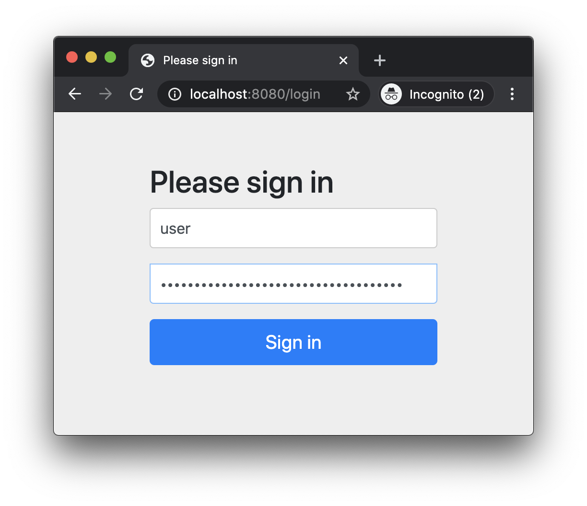
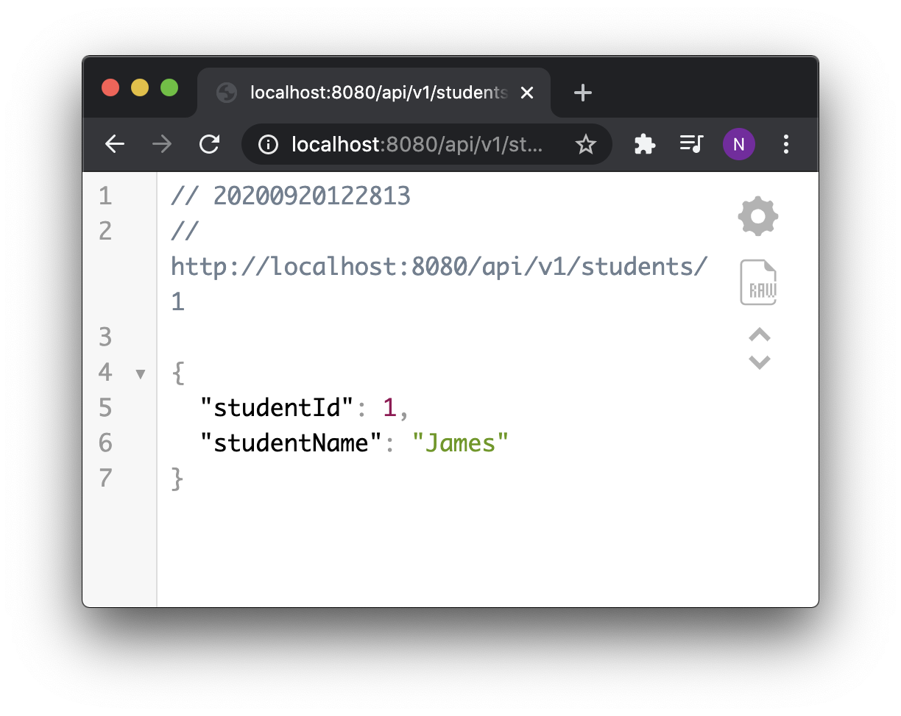

# 01 Installing Spring Security
## Add Spring Security Dependency
```gradle
dependencies {
    implementation 'org.springframework.boot:spring-boot-starter-security'
    testImplementation 'org.springframework.security:spring-security-test'
}
```
After running application, we get generated security password
```
Using generated security password: d32e18fc-45a6-4d43-8ab0-fb5d0503a94e
```
Then go to homepage, we get login page generated by Spring security. Login by using username *user* and password from generated security password.


After we log in to the application, we can see data from api


## Note
- default username = user

