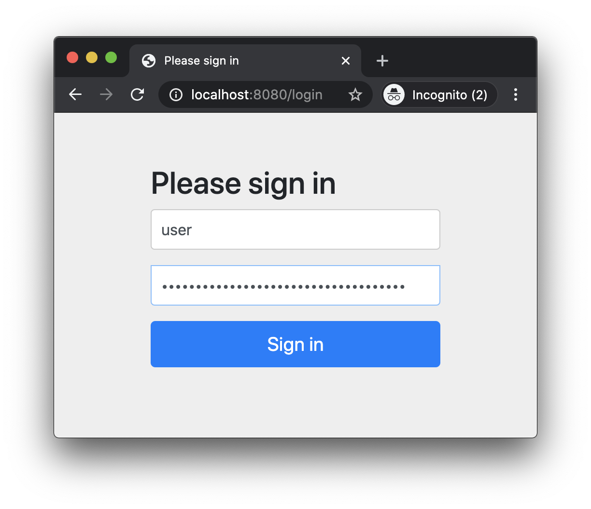
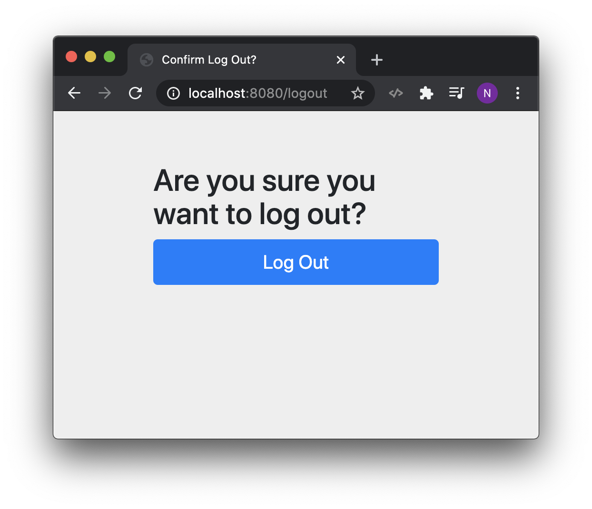
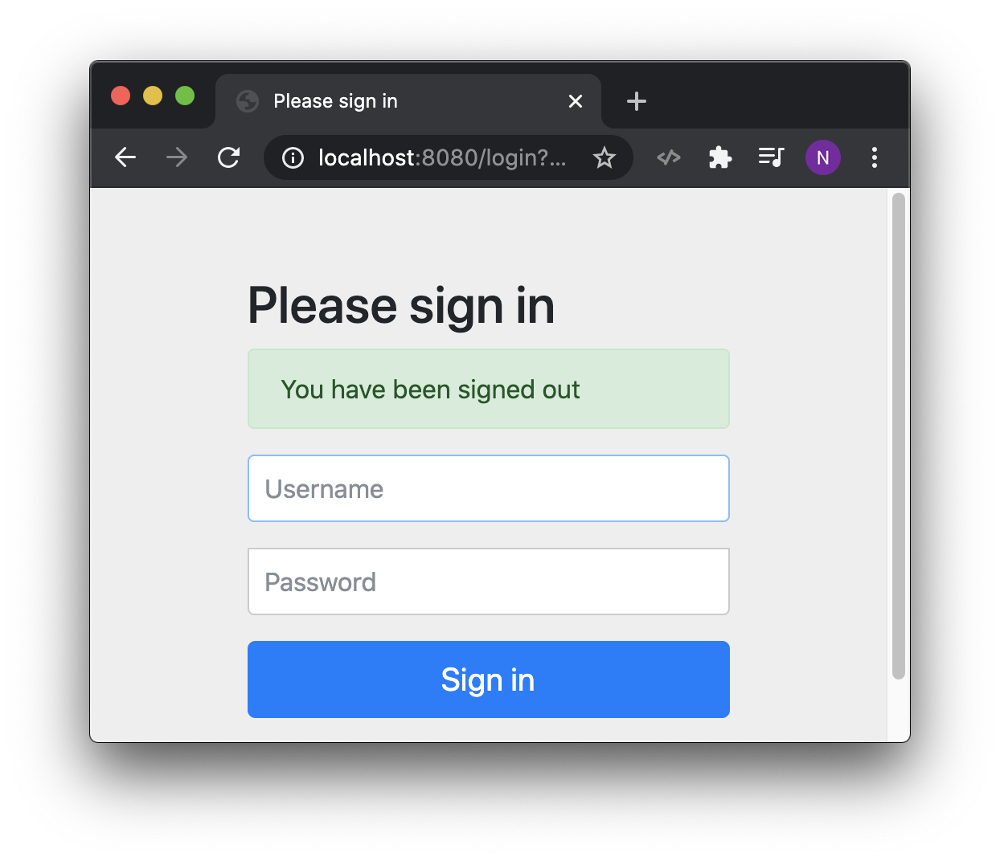

# 02 Form based authentication overview

- Default sign page */login*
- To logout */logout* then see *Are you sure you want to log out?* then click */logout*

When we log in, Spring makes sure the user exists and injects the password to backend.