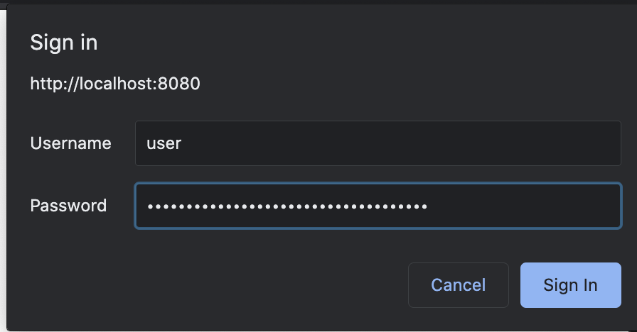

# 03 Basic Authentication

1. Client calls get request to server.
2. Server send 401 unauthorized because client has to send username and password to ser ver
3. Client calls get request with username and password with base64 encryption to server.
4. Spring security will check whether user exists and password is match or not. If user and password match, server will return 200 OK.

Configuration for Spring security
```java
@Configuration
@EnableWebSecurity
public class ApplicationSecurityConfig  extends WebSecurityConfigurerAdapter {
  @Override
  protected void configure(HttpSecurity http) throws Exception {
// Authenticate for any request
    http.authorizeRequests()
        .anyRequest()
        .authenticated()
        .and()
// with basic authentication
        .httpBasic();
  }
}
```

Basic auth from user


## Drawbacks
- Cannot log out because username and password sent with any request