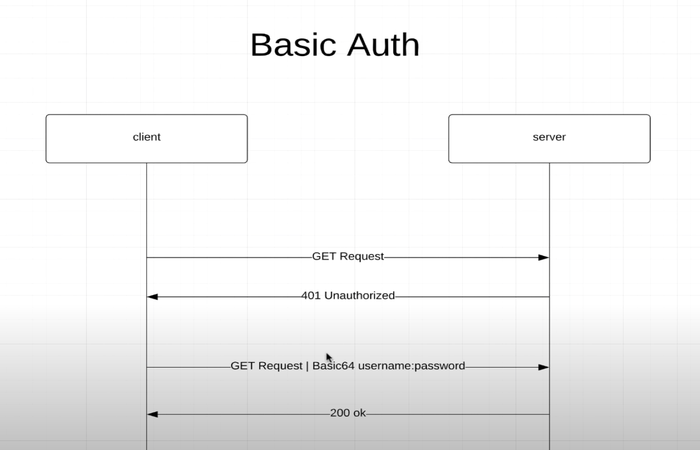

# Basic Authentication

1. Client calls get request to server.
2. Server send 401 unauthorized because client has to send username and password to ser ver
3. Client calls get request with username and password with base64 encryption to server.
4. Spring security will check whether user exists and password is match or not. If user and password match, server will return 200 OK.