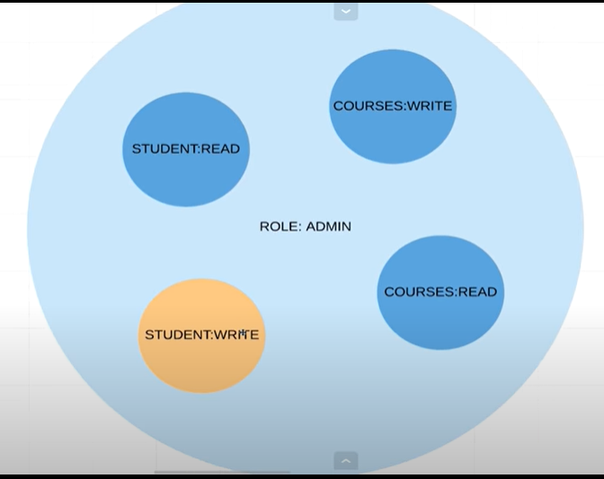

# 06 Roles and Permission

- Roles (ROLE:ADMIN) 
    - = High level view of all user in the system 
    - = Set of permission
- Permissions (STUDENTS:READ, COURSE:WRITE, etc.)
    - What user can do
    
These roles and permission help us to secure our API.

## Admin user
```java
@Configuration
@EnableWebSecurity
@RequiredArgsConstructor
public class ApplicationSecurityConfig  extends WebSecurityConfigurerAdapter {
  private final PasswordEncoder passwordEncoder;
  
  @Override
  @Bean
  protected UserDetailsService userDetailsService() {
// Define user
    UserDetails linda = User.builder()
        .username("linda")
        .password(passwordEncoder.encode("password123"))
// ROLES: ADMIN
        .roles("ADMIN")
        .build();
// keep user in memory     
    return new InMemoryUserDetailsManager(linda);
  }
}
```

## Roles and Permissions using enum
```gradle
# Add dependencies
dependencies {
    implementation 'com.google.guava:guava:11.0.2'
}
```

```java
// Enum for permission
@Getter
@AllArgsConstructor
public enum  ApplicationUserPermission {
  STUDENT_READ("student:read"),
  STUDENT_WRITE("student:write"),
  COURSE_READ("course:read"),
  COURSE_WRITE("course:write");

  private String permission;
}
```

```java
// Enum for role (contain with set of permission)
@Getter
@AllArgsConstructor
public enum  ApplicationUserRole {
  STUDENT(Sets.newHashSet()),
  ADMIN(Sets.newHashSet(COURSE_READ, COURSE_WRITE, STUDENT_READ, STUDENT_WRITE));

  private final Set<ApplicationUserPermission> permissions;
}
```

```java
// Replace roles & permissions with enum
@Configuration
@EnableWebSecurity
@RequiredArgsConstructor
public class ApplicationSecurityConfig  extends WebSecurityConfigurerAdapter {
  private final PasswordEncoder passwordEncoder;
  
  @Override
  @Bean
  protected UserDetailsService userDetailsService() {
    UserDetails anna = User.builder()
        .username("anna")
        .password(passwordEncoder.encode("password"))
        .roles(STUDENT.name())
        .build();

    UserDetails linda = User.builder()
        .username("linda")
        .password(passwordEncoder.encode("password123"))
        .roles(ADMIN.name())
        .build();

    return new InMemoryUserDetailsManager(anna, linda);
  }
}
```
